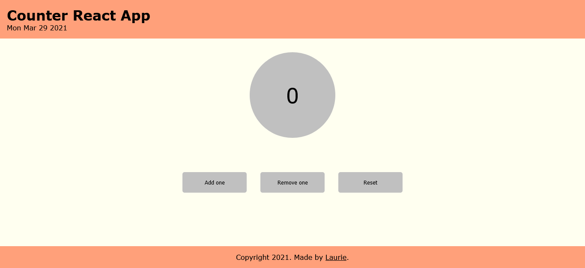
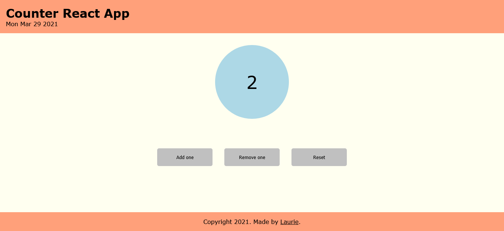
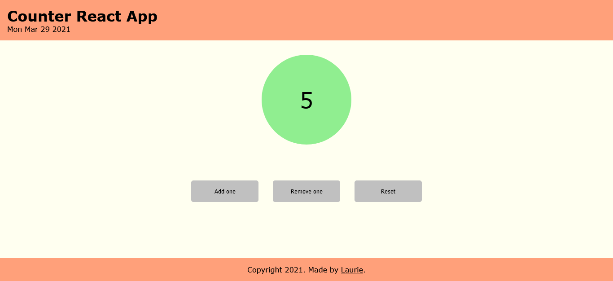

# Counter

This React App was created as the 3rd task for React.js as part of the Full Stack Web Development Program at [Business College Helsinki](https://en.bc.fi/qualifications/full-stack-web-developer-program/).

## Technologies used

Built with:

- HTML
- JS
- CSS
- Reactjs

## Setup and usage

Inside a cloned directory/folder, run:

```bash
npm install
```

## Screenshots

### Counter is Zero



### Counter is Even



### Counter is Odd



## Acknowledgment

Mentor: Margit Tennosaar

- GitHub @margittennosaar
- [LinkedIn](https://www.linkedin.com/in/margittennosaar/)
