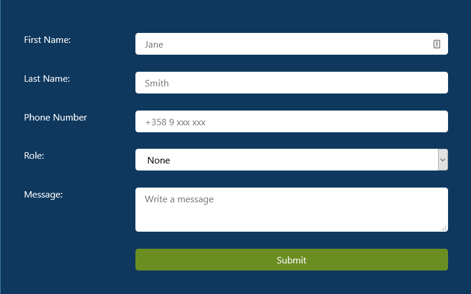
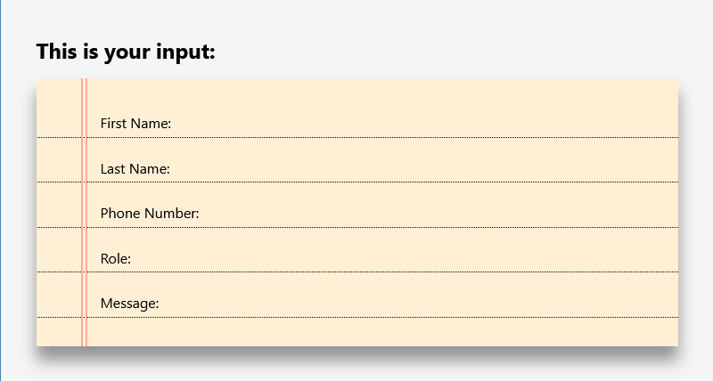
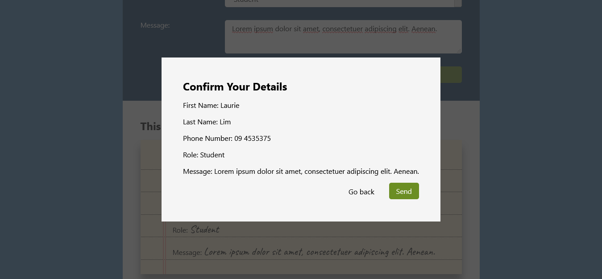

# Forms

This React App was created as the 5th task for React.js as part of the Full Stack Web Development Program at [Business College Helsinki](https://en.bc.fi/qualifications/full-stack-web-developer-program/). You can see a [live demo on netlify](https://laurielim-react-forms.netlify.app/).

## Technologies used

Built with:

- HTML
- JS
- CSS
- Reactjs

Hosted on:

- Netlify

## Setup and usage

Inside a cloned directory/folder, run:

```bash
npm install
npm install axios
```

## Screenshots

### Form Component



### View Component



### Popup Component



## Sources

[How to create an accessible React modal by Seif Ghezala](https://medium.com/@seif_ghezala/how-to-create-an-accessible-react-modal-5b87e6a27503)

## Acknowledgment

Mentor: Margit Tennosaar

- GitHub @margittennosaar
- [LinkedIn](https://www.linkedin.com/in/margittennosaar/)

### Instructions

1. Create new React app in reactjs_sandbox
2. Clean your react app
3. Update App.js to have class component
4. Create two new separated components: Form and View
5. In Form component have inputs (and labels) for:
   - First name (input)
   - Last name (input)
   - Phone number (input)
   - Role (select)
   - Message (textarea)
6. In View component includes:
   - Heading: “This is your input:”
   - Paragraphs with placeholders for:
   - First name
   - Last name
   - Phone number
   - Role
   - Message
7. Add states (firstname, lastname, phonenumber, role, message) to the App component and pass data to View component (example: props.firstname and firstname={this.state.firstname})
8. Add an event-handler method to manipulate the state (event.target.value). Note, to handle multiple inputs add a name attribute to each element and let the handler function choose what to do based on the value of event.target.name
9. Pass the event-handler method reference to the Form component and bind it to the input-change event (onChange)
10. Make new component: Popup
11. In Popup component make placeholders for:
    - First name, last name, phone number, role and message
    - Add close button for reload application
    - Hide popup by default (state – showPopup: false)
12. Add submit button to Form component and add check for emtpy inputs and textarea (by default react don’t know how to check select, so you can skip it).
13. Add an event-handler method for showing Popup component with submitted data.
14. Add styling of your choice. Here is example of one possible design:
15. Add screenshot from your application and add it to readme file.

You just learned how to make controlled components and work with forms.
